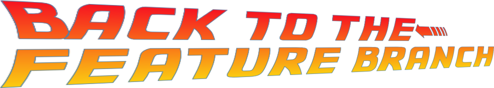

## (A git tutorial)

# Introduction

I used to teach in a bootcamp.

I rather enjoyed it, until I didn't.

One thing that stuck with me though is students would begin learning through the first two weeks, learning html, css, and a tiny bit of JavaScript, and then we would move to the third week, collaborative development. Almost all students, without fail, hit a cognative brick wall.

And that wall had a name; Git.

I often found students asking "is it like x", "oh so you mean it's like y?" and none of them were right, they were simply attempting to apply existing knowledge to a new problem domain, which is generally a logcal approach, but most students didn't have anything to relate it to, until one uneventful Tuesday it occured to me and someone asked: "Is it like 'Back To The Future'?".

Two things happened immediately.

About half the class had a moment of epiphany and realised what I was trying to teach, the other half of the class asked "What's 'Back To The Future?'", obviously the first half were the cooler students.

In this tutorial we will be following the story of Back To The Future using git as our Delorean, so if you are unfamiliar with the movie trilogy your first piece of homework is to watch, right now, no seriously. Go, I'll wait!

# Contents

- [Part 1](part1.md)
- [Part 2](part2.md)
- [Resources](resources.md)

# Resources

- [Back To The Future Timeline](https://backtothefuture.fandom.com/wiki/Back_to_the_Future_timeline)
